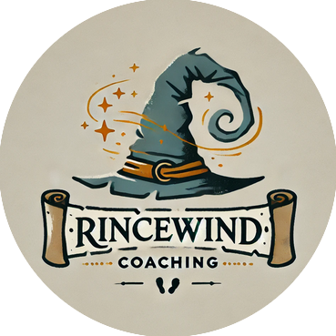

<!-- Improved compatibility of back to top link: See: https://github.com/othneildrew/Best-README-Template/pull/73 -->

<!-- PROJECT LOGO -->
 

  

  <h3 align="center">Rincewind Coaching</h3>

  

    Coaching site for Rincewind, a fictional person.
     
    <a href="https://dracula27.github.io/coachingSite/">View Site</a>
  

<!-- TABLE OF CONTENTS -->

  
Table of Contents

  <ol>
    <li>
      <a href="#about-the-project">About The Project</a>
      <ul>
        <li><a href="#built-with">Built With</a></li>
      </ul>
    </li>
    <li><a href="#usage">Usage</a></li>
    <li><a href="#optimizations">Optimizations</a></li>
    <li><a href="#lessons-learned">Lessons Learned</a></li>
    <li><a href="#contact">Contact</a></li>
    <li><a href="#acknowledgments">Acknowledgments</a></li>
  </ol>

<!-- ABOUT THE PROJECT -->

## About The Project

    

Rincewind is a fictional person used to demo building a coaching site for someone without any frameworks.

(<a href="#readme-top">back to top</a>)

### Built With

- 
- 
- 
- 

(<a href="#readme-top">back to top</a>)

<!-- USAGE -->

## Usage

View the site at [coaching site](https://dracula27.github.io/coachingSite/).

(<a href="#readme-top">back to top</a>)

<!-- OPTIMIZATIONS -->

## Optimizations

This project can be improved by:

- [ ] Integrating with a payment service
- [ ] Integrating with a scheduling service

(<a href="#readme-top">back to top</a>)

<!-- LESSONS LEARNED -->

## Lessons Learned

- **Collapsible Navbar**: I learned how to create a hamburger menu to collapse the navbar on smaller screens.

(<a href="#readme-top">back to top</a>)

<!-- CONTACT -->

## Contact

Danielle Andrews - [@DrAcula_codes](https://twitter.com/DrAcula_codes 'Twitter/X') - [daniellerandrews](https://www.linkedin.com/in/daniellerandrews 'LinkedIn') - danielle.andrews.dev@icloud.com

Project Link: [https://dracula27.github.io/coachingSite/](https://dracula27.github.io/coachingSite/)

(<a href="#readme-top">back to top</a>)

<!-- ACKNOWLEDGMENTS -->

## Acknowledgments

A special thanks to these resources used in the project!

- [ChatGPT](https://chatgpt.com/): for generating the logos.

(<a href="#readme-top">back to top</a>)

